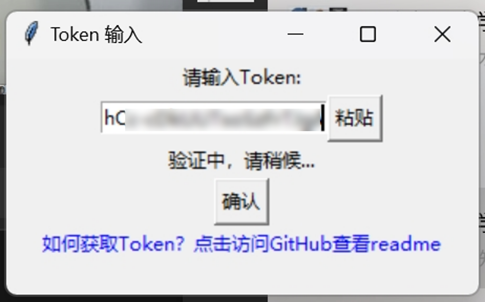

# bupt-classrooom-searcher

北京邮电大学校本部空闲教室查询脚本v2.3

## 简单介绍

本程序通过 Python 实现对教务系统-空闲教室抓包的数据进行处理，其中token获取部分需由用户自行完成。在下面会详细介绍如何使用

## 说明

- 这个程序是做什么的？本质上是把微信中学校提供的空闲教室进行整理汇总并排序出来，更方便地查询教室的空余时长
- 北邮教务系统电脑端官网并未提供空闲教室的入口，唯一的入口位于企业微信的微教学中，而微教学中的链接不支持用普通浏览器打开，因此需要通过抓包获得 json 数据。
- 此脚本现在仅支持爬取北邮本部数据，因为本人也只需要这一个功能。若要改成沙河其实很简单，只需要在代码 `url="https://jwglweixin.bupt.edu.cn/bjyddx/todayClassrooms?campusId=01"`这一行的`“=01”`改成`“=02”`，不过教室选项需要微调一下。话说回来，沙河图书馆那么大应该用不到这个功能吧。。。
- `token`会随着每次登入登出企业微信发生变化，但是在不触发登入登出时不变。所以只要电脑端不主动退出微信，`token`应该是不会变化的
- 本程序绝对安全，程序只会使用用户`token`对教务系统教室列表进行抓取，不会将其用于其他用途

## 更新说明

- v1.0 提供了命令行界面，实现输入指令对相同路径下唯一的json文件进行解析
- v1.1 实现对校本部所有教学楼、图书馆的支持
- v2.0 实现了GUI界面
- v2.1 实现通过在代码中嵌入token获取json数据，无须存放至文件夹中
- v2.2 实现token输入窗口及验证，无须在代码中修改token；打包.exe文件
- v2.3 实现历史记录的保存（上限为5条）；优化程序性能

## 功能页截图

## 使用方法

### 获取token：
1. 下载应用Fiddler，官网<https://www.telerik.com/fiddler>；
   
> 当然你也可以选择其他抓包工具，此处以fiddler为例

2. 打开fiddler，左侧会实时显示抓到的包；
   
3. 打开电脑端微信-北京邮电大学-微教学，在全部功能中选择“空闲教室查询”；
   

4. 在空闲教室页面加载好之后，fiddler中会显示以下抓到的包

5. 选择这一项，右侧会显示token值，右键选择copy value；
   

6. 关闭fiddler，打开freeTime.exe，将token粘贴在输入框内，点击查询；
    
> 此处检测是否查询成功的逻辑为：匹配“3-”字符串，若匹配成功则进入下一级界面

> 注意：此处若报错为`..Classrooms?campusld=01 (Caused by SSLError(SSLCertVerification..`，则应关闭fiddler

7. 在此界面选择睡觉地点，点击下面查询即可在文本框中显示查询到的空教室

> 上午和下午的分界线为12:30，自定义时间前需在选择框内选定“自定义”
8. 现在你可以去睡觉了
